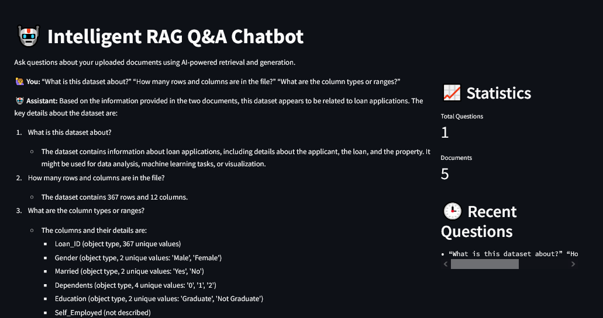
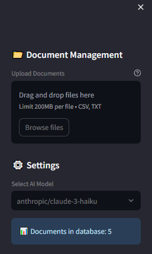
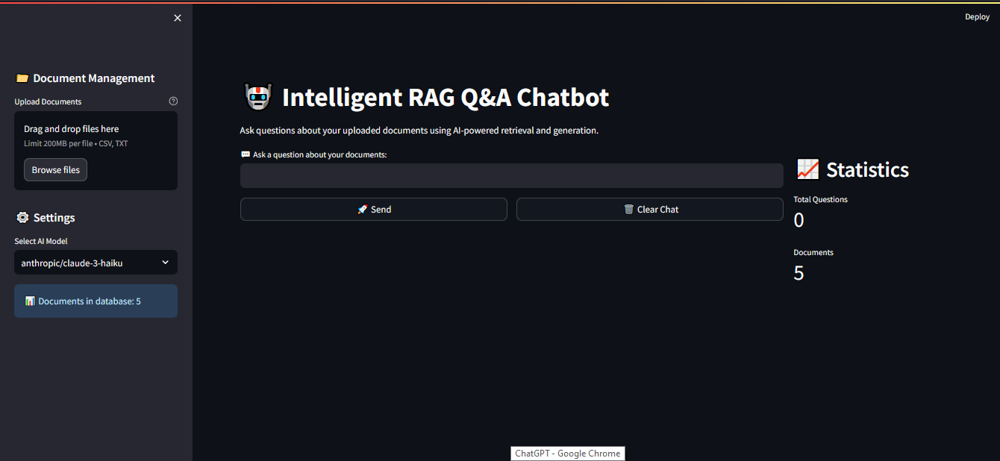

# 🤖 Intelligent RAG Q&A Chatbot

The **Intelligent RAG Q&A Chatbot** is a powerful document-based assistant that allows you to upload `.csv` and `.txt` files, extract structured summaries, and ask AI-powered questions over them using advanced **Retrieval-Augmented Generation (RAG)**.

---

## 📸 Screenshots

| Chatting with uploaded document | File Upload Panel | Streamlit UI |
|-------------------------------|--------------------|---------------|
|    |  |  |

---

## 🧠 Key Features

- 🔍 Ask questions like:
  - “What is this dataset about?”
  - “How many rows and columns?”
  - “What are the column types or ranges?”
- 📥 Upload `.csv` and `.txt` files
- 🧾 Automatic summarization and chunking of documents
- 🧠 Vector embeddings via `sentence-transformers`
- 🧪 Stores and queries vector embeddings using **Supabase with pgvector**
- 🤖 Uses **Claude 3 Haiku** (via OpenRouter API) to answer questions
- ❌ Delete individual responses or 🗑️ clear chat history
- 📊 Stats: Total documents & questions tracked
- 🌑 Dark themed Streamlit UI

---

## 🛠️ Tech Stack

| Layer           | Tool / Library                        |
|------------------|----------------------------------------|
| UI & Chat Flow   | `Streamlit`                            |
| File Parsing     | `Pandas`, `Python`                     |
| Vector Store     | `Supabase`, `pgvector`                 |
| Embedding Model  | `sentence-transformers`                |
| LLM Backend      | `Anthropic Claude-3-Haiku via OpenRouter` |
| API Handling     | `requests`, `.env`, `python-dotenv`    |

---

## 🚀 Setup Guide

### 1️⃣ Clone this repo

```bash
git clone https://github.com/yourusername/intelligent-rag-chatbot.git
cd intelligent-rag-chatbot
```

### 2️⃣ Install requirements

```bash
pip install -r requirements.txt
```

### 3️⃣ Add environment variables

Create a `.env` file in the root folder:

```env
OPENROUTER_API_KEY=your_openrouter_api_key
SUPABASE_URL=https://your-project.supabase.co
SUPABASE_ANON_KEY=your_supabase_anon_key
```

Alternatively, use the provided `.env.example` as a template:

```bash
cp .env.example .env
```

### 4️⃣ Run the Streamlit app

```bash
streamlit run app.py
```

You should now see the chatbot interface in your browser at `http://localhost:8501`.

---

## 💾 Supabase Setup (with pgvector)

Run the following SQL in your Supabase SQL Editor:

```sql
create extension if not exists vector;

create table documents (
  id serial primary key,
  content text,
  embedding vector(384),
  metadata jsonb,
  created_at timestamp with time zone default now()
);

create index on documents using ivfflat (embedding vector_cosine_ops);

create or replace function match_documents(
  query_embedding vector(384),
  match_threshold float,
  match_count int
)
returns setof documents as $$
  select * from documents
  where embedding <=> query_embedding < match_threshold
  order by embedding <=> query_embedding
  limit match_count;
$$ language sql stable;
```

---

## 🔑 OpenRouter API Setup

1. Visit [https://openrouter.ai](https://openrouter.ai)
2. Create a free account
3. Generate an API key
4. Add it to your `.env`:
   ```
   OPENROUTER_API_KEY=sk-openrouter-xxxx
   ```

---

## 📝 File Structure

```
📁 intelligent-rag-chatbot/
│
├── app.py                  # Main Streamlit app
├── document_processor.py   # Handles file reading & summarization
├── vector_store.py         # Handles Supabase vector logic
├── rag_engine.py           # Handles LLM response logic
├── requirements.txt
├── .env                    # Environment variables (ignored)
├── .env.example            # Template for collaborators
├── Screenshot/             # Contains UI screenshots
│   ├── Chatbot.PNG
│   ├── Fie_Uploading.PNG
│   └── RAG.PNG
```

---

## 🧪 Example Use

> 🙋 “What is this dataset about?”  
> 🤖 “The dataset contains information about loan applications, including applicant, loan amount, and property details. It may be used for ML or analysis.”

---

## 🚀 Deployment Options

You can deploy this app on:

- [Streamlit Cloud](https://streamlit.io/cloud)
- [Render](https://render.com/)
- [Vercel (via API backend + UI)](https://vercel.com/)
- Self-hosted with `ngrok`, Docker, or VM

---

## 🛡️ .env.example

```env
# .env.example
OPENROUTER_API_KEY=your_openrouter_api_key
SUPABASE_URL=https://your-project.supabase.co
SUPABASE_ANON_KEY=your_supabase_anon_key
```

---

## 📜 License

This project is licensed under the MIT License.

---

## 🙌 Acknowledgements

- [Supabase](https://supabase.com)
- [OpenRouter](https://openrouter.ai)
- [Streamlit](https://streamlit.io)
- [Sentence Transformers](https://www.sbert.net)

---

## 👨‍💻 Author

**Shubh Marwadi**  

